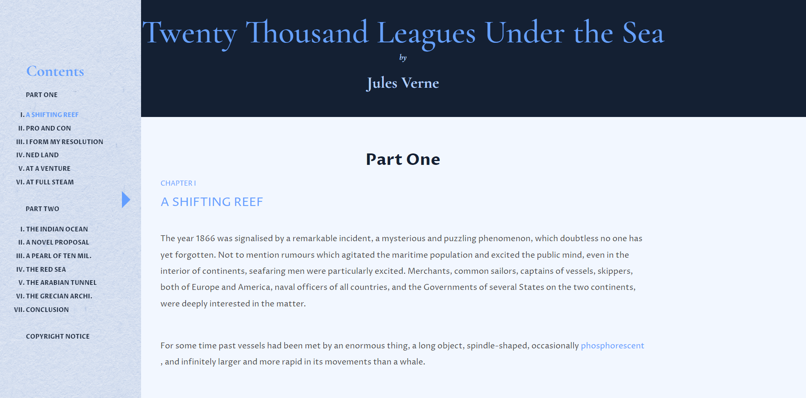

# Read Voyage Kindle App

## Overview
Read Voyage is a Kindle-like web application designed for reading "Twenty Thousand Leagues Under the Sea" by Jules Verne. This application provides a modern reading experience through a browser, integrating classic literature with contemporary web technologies.

## User Interface

  

## Features
- **Responsive Design**: Optimized for desktop and mobile devices.
- **Interactive Navigation**: Users can easily navigate between chapters and parts of the book through an interactive sidebar.
- **Dynamic Content Display**: Each chapter begins with a highlighted title, followed by the text of the book formatted for easy reading.
- **Integrated Definitions**: Certain terms within the text are clickable, revealing their definitions without needing to leave the page or disrupt the reading experience.
- **Progressive Navigation**: Navigation buttons at the end of each chapter allow for easy progression to the next or previous chapter.

## File Structure
- `index.html` - The main entry point of the application containing the home page.
- `chapter2.html`, `chapter3.html`, etc. - Individual chapter pages.
- `final.html` - Contains the chapters of the final part of the book.
- `conclusion.html` - The conclusion page of the book.
- `copyrights.html` - The page displaying copyright information.

## Styles
- `reset.css` - Resets the styling to ensure consistency across browsers.
- `style.css` - Contains custom styles for the application, including fonts, layout, and interactive elements.

## Fonts
- **Cormorant Garamond** and **Proza Libre**: Used throughout the app to enhance readability and aesthetics.

## Icons and Images
- `favicon.ico` - The favicon for the app, displayed in the browser tab.
- Navigation icons and other imagery are linked externally, ensuring that the layout is visually appealing and functionally intuitive.

## Development
This application was created by Nguyen Hoang Son in 2023. It uses straightforward HTML and CSS, making it easily maintainable and modifiable for future expansions or iterations.

## Usage
To use the Read Voyage Kindle App:
1. Open the `index.html` in any modern web browser.
2. Use the navigation bar to access different parts and chapters of the book.
3. Click on highlighted words to view definitions in a pop-up overlay.
4. Use the navigation buttons at the bottom of each page to move between chapters.

## Browser Compatibility
The app is compatible with all modern web browsers including Chrome, Firefox, Safari, and Edge.

## Credits
- **Author**: Jules Verne
- **Developer**: Nguyen Hoang Son

Thank you for choosing Read Voyage for your digital reading experience! Enjoy exploring the depths of the sea with Captain Nemo and his crew aboard the Nautilus.